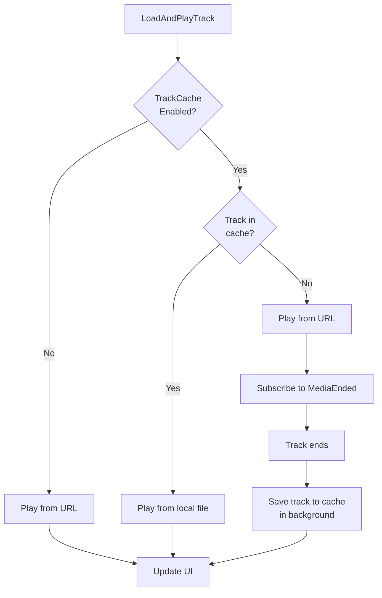

# План реализации кеша треков (аудиофайлов)

## Стратегия кеширования
- **Стриминг + фоновое сохранение**: трек играет из оригинального URL, после завершения воспроизведения сохраняется в кеш
- При повторном воспроизведении — подмена URL на локальный путь к файлу
- При старте приложения — проверка лимита размера кеша и удаление старых файлов

---

## 1. TrackCacheManager.cs — основной сервис кеширования треков

**Путь**: `VK UI3/Services/TrackCacheManager.cs`

### Структура класса:
```csharp
public static class TrackCacheManager
{
    // Константы
    private const string CACHE_SUBDIR = "tracksCache";
    
    // Методы
    public static string GetCacheDirectory();
    public static string GetCachedFilePath(long ownerId, long audioId);
    public static bool IsTrackCached(long ownerId, long audioId);
    public static async Task<string?> GetCachedTrackPathAsync(long ownerId, long audioId);
    public static async Task CacheTrackAsync(Uri trackUrl, long ownerId, long audioId);
    public static long GetCacheSizeBytes();
    public static int GetCacheFileCount();
    public static void ClearCache();
    public static void EnforceCacheSizeLimit(int maxSizeMb);
}
```

### Детали реализации:
- **Папка хранения**: `%APPDATA%/VKMMKZ/tracksCache/`
- **Имя файла**: `{OwnerID}_{AudioID}.mp3`
- **Скачивание**: `HttpClient` с прогрессом, запись в файл через `FileStream`
- **EnforceCacheSizeLimit**: сортировка файлов по дате создания, удаление самых старых при превышении лимита
- **Потокобезопасность**: используем `SemaphoreSlim` для синхронизации скачиваний

---

## 2. UI-контролы для настроек кеша треков

### 2.1 TrackCacheEnabledSetting.cs
**Путь**: `VK UI3/Views/Settings/TrackCacheEnabledSetting.cs`
- Наследует `CheckBox` (sealed)
- Читает/пишет `trackCacheEnabled` через `CacheSettingsManager`
- По умолчанию: включено (true)

### 2.2 TrackCacheMaxSizeSetting.cs
**Путь**: `VK UI3/Views/Settings/TrackCacheMaxSizeSetting.cs`
- Наследует `Slider` (sealed)
- Диапазон: 100–50000 МБ (100 МБ – 50 ГБ)
- Шаг: 100 МБ
- По умолчанию: 5000 МБ (5 ГБ)
- Читает/пишет `trackCacheMaxSizeMb` через `CacheSettingsManager`

### 2.3 ClearTrackCacheButton.cs
**Путь**: `VK UI3/Views/Settings/ClearTrackCacheButton.cs`
- Наследует `Button` (sealed)
- Отображает текущий размер кеша и количество файлов
- При нажатии очищает кеш через `TrackCacheManager.ClearCache()`
- Аналогичен `ClearImageCacheButton.cs`

---

## 3. Модификация CacheSettingsManager.cs

**Путь**: `VK UI3/Services/CacheSettingsManager.cs`

### Добавить ключи настроек:
```csharp
public const string TrackCacheEnabledKey = "trackCacheEnabled";
public const string TrackCacheMaxSizeMbKey = "trackCacheMaxSizeMb";
```

### Добавить значения по умолчанию:
```csharp
public const bool DefaultTrackCacheEnabled = true;
public const int DefaultTrackCacheMaxSizeMb = 5000; // 5 ГБ
```

### Добавить методы:
```csharp
public static bool IsTrackCacheEnabled();
public static void SetTrackCacheEnabled(bool enabled);
public static int GetTrackCacheMaxSizeMb();
public static void SetTrackCacheMaxSizeMb(int sizeMb);
public static void ClearTrackCache();
public static long GetTrackCacheSizeBytes();
public static int GetTrackCacheFileCount();
```

---

## 4. Модификация CacheSettingsExpander.xaml/.cs

### XAML — добавить блок "Кеш треков" после блока "Кеш изображений":

```xml
<!--  Кеш треков  -->
<Border Padding="12" CornerRadius="4">
    <StackPanel Spacing="8">
        <TextBlock FontWeight="SemiBold" Text="Кеш треков" />

        <local:TrackCacheEnabledSetting />

        <StackPanel>
            <TextBlock Text="Максимальный размер кеша (МБ)" />
            <Grid>
                <Grid.ColumnDefinitions>
                    <ColumnDefinition Width="*" />
                    <ColumnDefinition Width="Auto" />
                </Grid.ColumnDefinitions>
                <local:TrackCacheMaxSizeSetting
                    x:Name="trackCacheMaxSize" />
                <TextBlock
                    x:Name="trackCacheMaxSizeValue"
                    Grid.Column="1"
                    Margin="10,0,0,0"
                    VerticalAlignment="Center" />
            </Grid>
        </StackPanel>

        <local:ClearTrackCacheButton Margin="0,8,0,0" />
    </StackPanel>
</Border>
```

### Code-behind — добавить обработчики:
```csharp
trackCacheMaxSize.ValueChanged += TrackCacheMaxSize_ValueChanged;
UpdateTrackCacheMaxSizeText();

private void TrackCacheMaxSize_ValueChanged(object sender, RangeBaseValueChangedEventArgs e)
{
    UpdateTrackCacheMaxSizeText();
}

private void UpdateTrackCacheMaxSizeText()
{
    trackCacheMaxSizeValue.Text = $"{(int)trackCacheMaxSize.Value / 1000.0:F1} ГБ";
}
```

---

## 5. Интеграция в MediaPlayerService.LoadAndPlayTrack()

**Путь**: `VK UI3/Services/Player/MediaPlayerService.cs`

### Логика в `LoadAndPlayTrack` (после строки 762, перед созданием MediaSource):

```csharp
// Проверка кеша треков
string? cachedPath = null;
if (CacheSettingsManager.IsTrackCacheEnabled())
{
    cachedPath = await TrackCacheManager.GetCachedTrackPathAsync(
        (long)trackdata.audio.OwnerId, 
        (long)trackdata.audio.Id);
}

Uri trackUri;
if (cachedPath != null)
{
    trackUri = new Uri(cachedPath);
    System.Diagnostics.Debug.WriteLine($"[TrackCache] Using cached track: {cachedPath}");
}
else
{
    trackUri = new Uri(trackdata.audio.Url.ToString());
    
    // Если кеш включён, но трека нет — планируем фоновое сохранение после завершения
    if (CacheSettingsManager.IsTrackCacheEnabled())
    {
        var ownerId = (long)trackdata.audio.OwnerId;
        var audioId = (long)trackdata.audio.Id;
        var url = trackdata.audio.Url;
        
        // Подписываемся на MediaEnded для сохранения в кеш
        Windows.Media.Playback.MediaPlayer handler = null;
        handler = _mediaPlayer; // захват для отписки
        // Используем одноразовую подписку
        EventHandler<object> onEnded = null;
        onEnded = async (s, e) =>
        {
            _mediaPlayer.MediaEnded -= onEnded;
            await TrackCacheManager.CacheTrackAsync(url, ownerId, audioId);
        };
        _mediaPlayer.MediaEnded += onEnded;
    }
}

var mediaSource = Windows.Media.Core.MediaSource.CreateFromUri(trackUri);
```

**Важно**: При использовании кешированного локального пути FFmpeg путь (`LoadWithMediaSources`) может не работать с локальными файлами. Нужно проверить: если `cachedPath != null` — принудительно использовать `LoadBasicMediaItem`.

---

## 6. Модификация App.xaml.cs

**Путь**: `VK UI3/App.xaml.cs`

### Добавить после блока автоочистки кеша изображений (после строки 241):

```csharp
// Применяем лимит кеша треков при запуске
if (CacheSettingsManager.IsTrackCacheEnabled())
{
    int maxSizeMb = CacheSettingsManager.GetTrackCacheMaxSizeMb();
    TrackCacheManager.EnforceCacheSizeLimit(maxSizeMb);
}
```

---

## 7. Сборка и проверка

1. `dotnet clean` в корне решения
2. `dotnet build` — проверить отсутствие ошибок компиляции
3. Запустить приложение, проверить:
   - Отображение блока "Кеш треков" в настройках
   - Включение/выключение кеша треков
   - Изменение максимального размера
   - Очистку кеша
   - Воспроизведение трека — проверка логов `[TrackCache]`
   - Повторное воспроизведение — должно играть из кеша

---

## Диаграмма потока воспроизведения с кешем



---

## Зависимости

- `System.Net.Http` — для `HttpClient` (уже есть в проекте)
- `System.IO` — для работы с файлами (уже есть)
- Никаких новых NuGet-пакетов не требуется